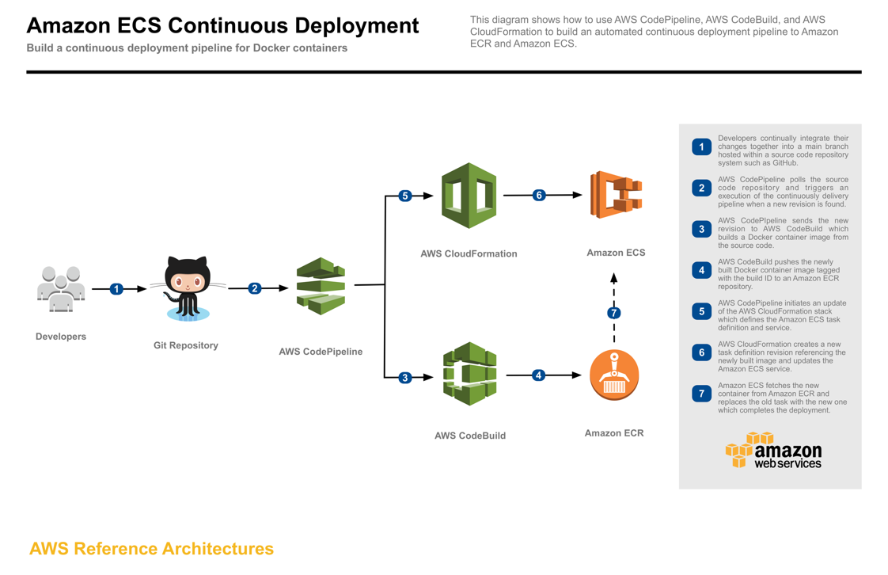

# Continuous Deployment to Amazon EC2 Container Service (ECS) using AWS CodeBuild and AWS CodePipeline

## Introduction

This reference architecture provides a AWS CloudFormation template and AWS Lambda function to demonstrate how to achieve continuous deployment of a Docker container to Amazon EC2 Container Service (ECS). With continuous deployment, software revisions are deployed to a production environment automatically without explicit approval from a developer, making the entire software release process automated.

Launching this stack will provision a continuous deployment process that uses AWS CodePipeline to monitor a GitHub repository for new commits, AWS CodeBuild to create a new Docker container image and to push it into Amazon EC2 Container Registry (ECR), and AWS Lambda to deploy the new container image to production on Amazon ECS.



## Usage

### Step 1: Create an ECS Cluster for Deployment

This architecture requires an existing Amazon ECS cluster as a deployment target. If you do not have one available, use the [Deploying Microservices with Amazon ECS, AWS CloudFormation, and an Application Load Balancer][ecs-cfn-refarch] reference architecture to create a cluster for testing purposes.

Double check to ensure that any security groups or network access control lists governing your Amazon ECS cluster allows other hosts on your VPC to reach all of its ports to permit the Application Load Balancer created as part of this reference architecture to reach it.

### Step 2: Fork the Amazon ECS Sample App GitHub Repository

[Fork](https://help.github.com/articles/fork-a-repo/) the [Amazon ECS sample app](https://github.com/awslabs/ecs-demo-php-simple-app) GitHub repository into your GitHub account.

From your terminal application, execute the following command (make sure to replace `<your_github_username>` with your actual GitHub username):

```console
git clone https://github.com/<your_github_username>/ecs-demo-php-simple-app
```

This creates a directory named `ecs-demo-php-simple-app` in your current directory containing the code for the Amazon ECS sample app.

### Step 3: Create the CloudFormation Stack

Click **Launch Stack** to launch the template in the US East (N. Virginia) Region in your account:

[](https://console.aws.amazon.com/cloudformation/home?region=us-east-1#/stacks/new?stackName=ecs-refarch-cd&templateURL=https://s3.amazonaws.com/ecs-refarch/ecs-refarch-continuous-deployment.yaml)

The CloudFormation template requires the following parameters:

- ECS Cluster Configuration
  - **ECS Cluster**: The name of an existing ECS cluster onto which the pipeline will deploy a sample service upon any code change.
  - **VPC**: The ID of the VPC on which the ECS cluster resides.
  - **Subnets**: Two or more public subnets which will be used to host an Application Load Balancer for the sample service.

- GitHub Configuration
  - **Repo**: The repo name of the sample service.
  - **Branch**: The branch of the repo to continuously deploy.
  - **User**: Your username on GitHub.
  - **Personal Access Token**: Token for the user specified above. ([https://github.com/settings/tokens](https://github.com/settings/tokens))

The CloudFormation stack provides the following output:

- **ServiceURL**: URL of the load balancer for the sample service.
- **Pipeline**: Continuous deployment pipeline.

After the CloudFormation stack is created, the latest commit to the GitHub repository is run through the pipeline and deployed to ECS.


To test continuous deployment, make a change to the repository and push it to GitHub. CodePipeline will detect the change, build the new application, and deploy it onto your cluster automatically. Open the CodePipeline console using the link in the above **Pipeline** output to monitor its progress.

## License

Copyright 2011-2017 Amazon.com, Inc. or its affiliates. All Rights Reserved.

Licensed under the Apache License, Version 2.0 (the "License"). You may not use this file except in compliance with the License. A copy of the License is located at [http://aws.amazon.com/apache2.0/](http://aws.amazon.com/apache2.0/) or in the "license" file accompanying this file. This file is distributed on an "AS IS" BASIS, WITHOUT WARRANTIES OR CONDITIONS OF ANY KIND, either express or implied. See the License for the specific language governing permissions and limitations under the License.

[ecs-cfn-refarch]: https://github.com/awslabs/ecs-refarch-cloudformation:!o
